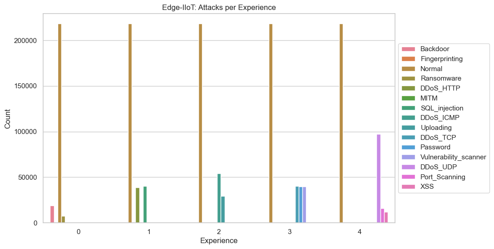
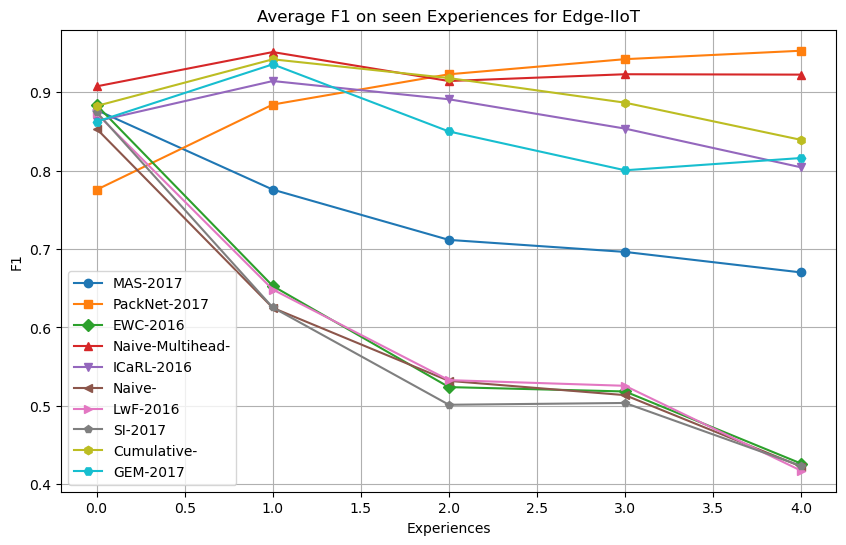

# Edge-IIoT Continual Learning 

Graph of class distribution per experience:

Note there is a significant class imbalance particularly more normal class than other attacks. Some classes have very small # of examples. 
Trained for 5 epochs using the ADAM optimizer; Adam performs significantly better than SGD w/ momentum

## Non-Continual Learning Baseline

Classification Report:  (Note support numbers are from test set)
      Unnamed: 0  precision    recall  f1-score        support
0              0   0.946858  0.948199  0.947528    4942.000000
1              1   0.731659  0.952800  0.827713    9661.000000
2              2   0.993160  0.999341  0.996241   13658.000000
3              3   0.816623  0.999097  0.898691    9962.000000
4              4   0.999504  0.999917  0.999711   24189.000000
5              5   0.428571  0.019608  0.037500     153.000000
6              6   1.000000  0.987500  0.993711      80.000000
7              7   0.999985  0.999996  0.999991  272775.000000
8              8   0.526518  0.411219  0.461780   10019.000000
9              9   0.992936  0.485446  0.652087    4054.000000
10            10   0.905049  0.853962  0.878764    1931.000000
11            11   0.482329  0.669256  0.560621   10298.000000
12            12   0.644012  0.484455  0.552953    7237.000000
13            13   0.949661  0.854258  0.899437   10004.000000
14            14   0.558095  0.197174  0.291397    2972.000000
15      accuracy   0.947289  0.947289  0.947289       0.947289
16     macro avg   0.798331  0.724149  0.733208  381935.000000
17  weighted avg   0.948790  0.947289  0.944884  381935.000000

If the macro avg of this baseline is taken per experience the results are:

{0: 0.6061032945447724,
 1: 0.7940151645281128, 
 2: 0.7774516379611114, 
 3: 0.7051322531362252, 
 4: 0.6259542321535095
}

## CL Baselines

### TASK FREE BASELINES

- ICaRL
- GEM
- EWC
- SI (Double check)
- LwF (Double Check)
- MAS 

### TASK INFORMED BASELINES

- Niave-Multihead
- PackNet

Results of each dataset on past experiences:

### High Performers

The two best performers are PackNet and Niave-Multihead, which I believe is due to the extra information of being task-informed. That means these models can effectively rule out which experience the task is in and only focus on distringuishing those attacks. I think this is more beneficial in Edge-IIoT than X-IIoT because Edge-IIot has the hard to distinguish classes. For instance some attacks are undistinguishable from normal, so if the model can rule these out in a different experience it will perform better. 

PackNet however has poor initial preformance, which is due to PackNet's agresssive pruning after learning. 

### Middle Performers

Cumulative performs best of the task free-baselines which is expected. All replay methods (ICaRL and GEM) perform better than regularization methods. 

MAS performs significantly better than the other regularization methods in this dataset.
### Low Performers

SI, EWC, LwF all perform the save as Niave. This shows they are ineffective (Or possibly implemented wrong, however I couldn't find the issue.)