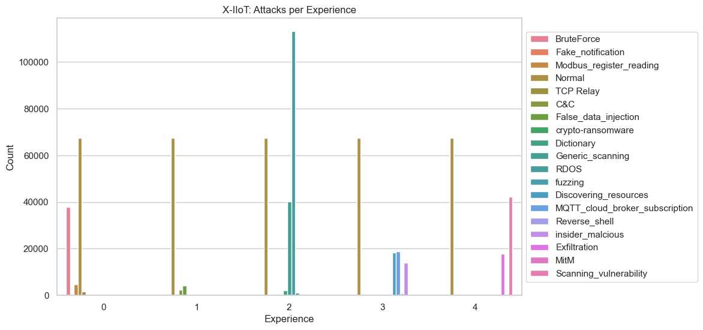
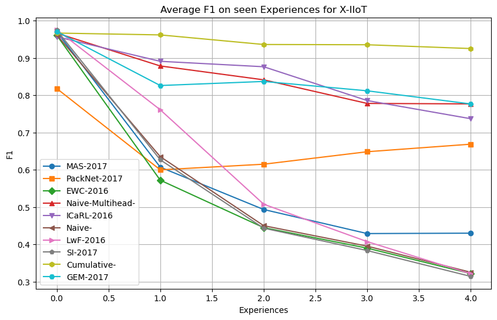

# X - IIoT Continual Learning Result Ananlysis

Graph of class distribution per experience:

Note there is a significant class imbalance particularly more normal class than other attacks. Also note exerience 2 has significant imbalance with a very well supported attack.
Trained for 5 epochs using the ADAM optimizer; Adam performs significantly better than SGD w/ momentum

## Non-Continual Learning Baseline

Classification Report:  (Note support numbers are from test set)

      Unnamed: 0  precision    recall  f1-score        support
               0   0.999573  0.997977  0.998775    9392.000000
               1   0.790625  0.841930  0.815471     601.000000
               2   0.974560  0.941399  0.957692     529.000000
               3   0.924728  0.664483  0.773297    4733.000000
               4   0.997311  0.998878  0.998094    4455.000000
               5   1.000000  0.833333  0.909091       6.000000
               6   0.941794  0.970501  0.955932    1017.000000
               7   0.993961  0.991997  0.992978   10121.000000
               8   0.993762  0.990566  0.992161    4664.000000
               9   0.538462  0.350000  0.424242      20.000000
            10   0.998309  0.988285  0.993272    1195.000000
            11   0.976248  0.993144  0.984624   84303.000000
            12   0.998970  0.999219  0.999094   28156.000000
            13   0.934911  0.822917  0.875346     192.000000
            14   0.983568  0.993868  0.988691   10600.000000
            15   0.916667  0.652062  0.762048     388.000000
            16   0.975000  0.917647  0.945455      85.000000
            17   0.857143  0.531646  0.656250     237.000000
            18   0.999423  0.998272  0.998848    3473.000000
      accuracy   0.982463  0.982463  0.982463       0.982463
     macro avg   0.936580  0.867270  0.895861  164167.000000
    weight avg   0.981966  0.982463  0.981441  164167.000000

If this is grouped by experience and macro F1 is taken for each experience:
{
0: 0.9295617720224992, 
1: 0.9253704172950526,
2: 0.9181276445904334,
3: 0.9248552292880312, 
4: 0.848912691486321
}

Note: this is trained on 5 epochs, this is because I trained the CL baselines on 5 epochs per experience. 

## CL Baselines

### TASK FREE BASELINES

- ICaRL
- GEM
- EWC
- SI (Double check)
- LwF (Double Check)
- MAS 

### TASK INFORMED BASELINES

- Niave-Multihead
- PackNet

Results of each dataset on past experiences:

### HIGH PERFORMERS
Cumulative performs the best, which is expected. Acheives similar eval results to DNN without CL. Which is also expected.

Behind that is Niave-Multihead, ICaRL, and GEM all with similar results. Note that ICaRL and GEM are the only memory based techniques and they both preform better than all others.

Niave-Multihead preforms well because it has a new head for each task, and is away of experience ID. It is a cheater.

### Middle Performers

I would say PackNet is the only "middle" performer.
 
PackNet is also tack aware, which can be viewed as cheating. But it does not grow parameters like niave multihead. It performs better than regularization methods but not better than memory methods. This could be do to model pruning that lowers it's f1 score. Packnet actually maintains very good accuracy throughout but bad f1 score. 

Packnet has to re-learn normal attack at each experience --- could be reason for worse performance. 

### Bad Performers

LwF is better than most other methods at experience 2, however rapidly forgets after experience 2. Shows a semi-effective regularization technique that works slightly, however does not work over time. 

MAS, EWC, and SI, all hover around the same results as Niave. However MAS is the only one that does better than Niave. 
